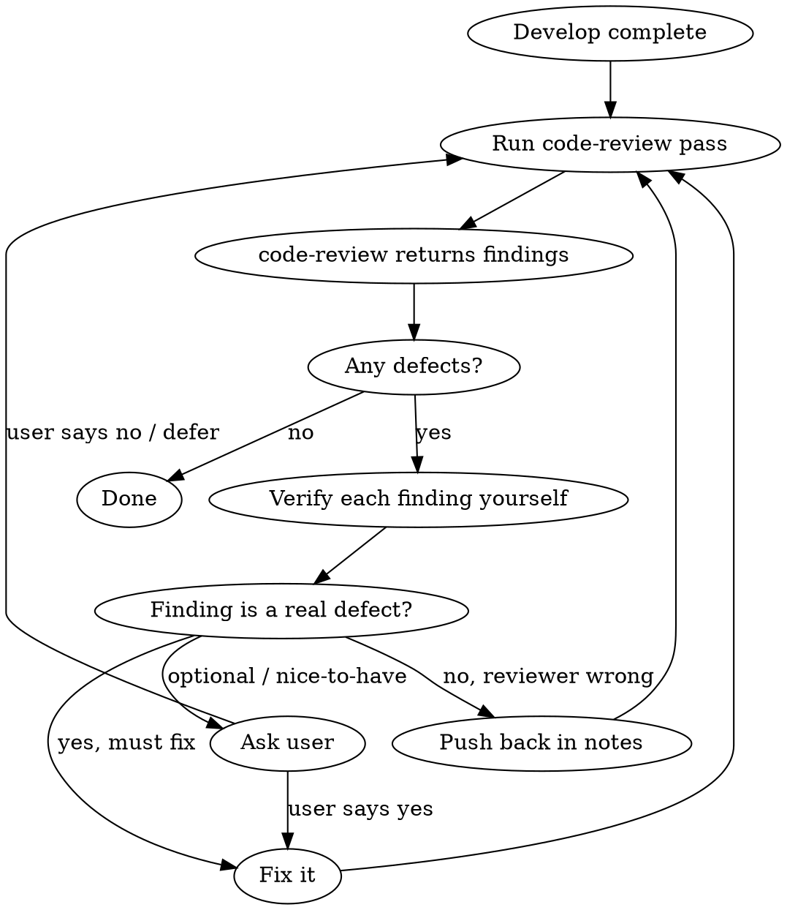

# Review Until Clean

## 概览

反复 review，一直循环到代码库零问题为止。既独立 review，又亲自核实。

```
Develop → Run code-review → Verify each finding yourself → Fix real issues → Re-review → repeat until clean
```

**两大原则：**

1. **每条报告的问题都亲自核实。** Reviewer 只是给假设，不代表一定对。打开文件，读引用行的代码，确认 bug 确实存在再动手。Reviewer 会胡编问题、会读错范围、会把风格问题包装成 defect。照单全收 → 反复折腾 + 引入新 bug。

2. **只改必须改的。** 真正的 defect —— Standards hard violation、Spec gap、行为错误 —— 改掉。Judgement-call smell 和"锦上添花"的打磨 → 抛给用户，绝不进 fix loop（否则打磨会让这个循环无限打转）。

**必备子 skill：** 用 `code-review` 跑 review —— 它对 `BASE_SHA...HEAD` diff 跑 Standards + Spec review，返回 findings 报告，由你来核实。

## 何时使用

**仅手动触发。** 只有用户显式调用时（如 `/review-until-clean`）才跑。绝不因"代码写完了""准备合并"或任何推断而自动加载——哪怕看起来完美匹配。觉得适用，向用户建议，别自己加载。

典型用法：
- 功能/代码库已开发完成
- 合并到 main / 发版前
- 用户要的是干净的 reviewer 签字，不是"我扫了一眼"

**不要用于：** 单个琐碎改动（自己 review 就行），或 subagent-driven development 里任务中途的检查点（按任务直接用 `code-review`）。

## 循环



### 第 1 步 —— 跑 code review

对 `BASE_SHA...HEAD` 范围调用 `code-review`，把 `BASE_SHA` 作为 fixed point 传入。它跑 Standards + Spec review（并行 sub-agent，各自独立 context），返回 findings 报告。

每一轮都针对**全新的 base→head 范围**，覆盖从原始基线到现在的所有改动——reviewer 看到的是累积状态，而不只是最后一个 delta。把 `BASE_SHA` 固定在原始起始 commit；边改边推进 `HEAD_SHA`。

### 第 2 步 —— 亲自核实每条 finding

这是铁律。对 `code-review` 报告的每条问题：

1. 打开它引用的那个 `file:line`。
2. 亲自看一下上下文代码。
3. 做出三选一的判断：

| 判断 | 含义 | 动作 |
|---------|---------|--------|
| **真 defect，必须改** | 你已确认的 Standards hard violation、Spec gap，或 bug/异常行为/安全漏洞/数据丢失风险 | 立即改 |
| **Reviewer 错了** | 它读错了代码，那个"bug"其实是对的，或超出了范围 | 不改代码。记下 pushback 和你的技术理由 |
| **可选 / 锦上添花** | judgement-call smell（`code-review` 的 smell baseline）、小优化或打磨——没有它代码也能正确运行 | 问用户要不要改；绝不默默改掉，也绝不默默丢弃 |

**核实这件事必须你亲自做，不能甩给另一个 subagent。** `code-review` 的 sub-agent 只是给假设。这个 skill 的核心：由主 session 负责辨别真假。不要把这个判断甩给 subagent。

### 第 3 步 —— 修掉真正的、必须改的问题

- 只改你亲自确认过的。
- 改完跑一下测试（如果项目有的话）。
- 暂存并提交修复，让下一轮 review 看到干净的历史。
- 更新 `HEAD_SHA`。

### 第 4 步 —— 重新 review 并重复

再次跑 `code-review`，同样的 `BASE_SHA`，新的 `HEAD_SHA`。停止条件见下一节。

## 何时停止

**停下（干净）的时机：** `code-review` 报告里零 defect——没有 Standards hard violation，没有 Spec gap。一轮只剩 judgement-call smell / 可选项，也算干净：抛给用户，不要 fix-and-reloop。

**停下（卡住）并问用户的时机：**
- 连续两轮对某个东西是不是 bug 意见不一 → 你在瞎猜。问。
- 4+ 轮 review 还没收敛 → 大概率是设计分歧，不是找 bug。交给用户定夺。
- 某条 finding 确实可选 → 别急着花一轮去修，先问用户。

## Fix Triage —— 只有三类

核实过的 finding 恰好归入上面三类的某一类（见第 2 步的判断表）。不存在第四类"反正简单我就顺手改了"。

要避开的陷阱：bug-fix loop 演变成永不收敛的 refactor/polish loop。可选改进 ≠ bug，不该混进收敛循环。

## Checklist（每轮）

- [ ] `code-review` 跑在正确的 BASE→HEAD 范围上
- [ ] 每条 finding 都按三档判断表核过：打开 file:line，读了代码，归了类
- [ ] Must fix 的已改、已跑测试、已提交；Push back 已记理由；Ask user 的已抛给用户
- [ ] 还有 defect → 下一轮。否则 → 完成。
