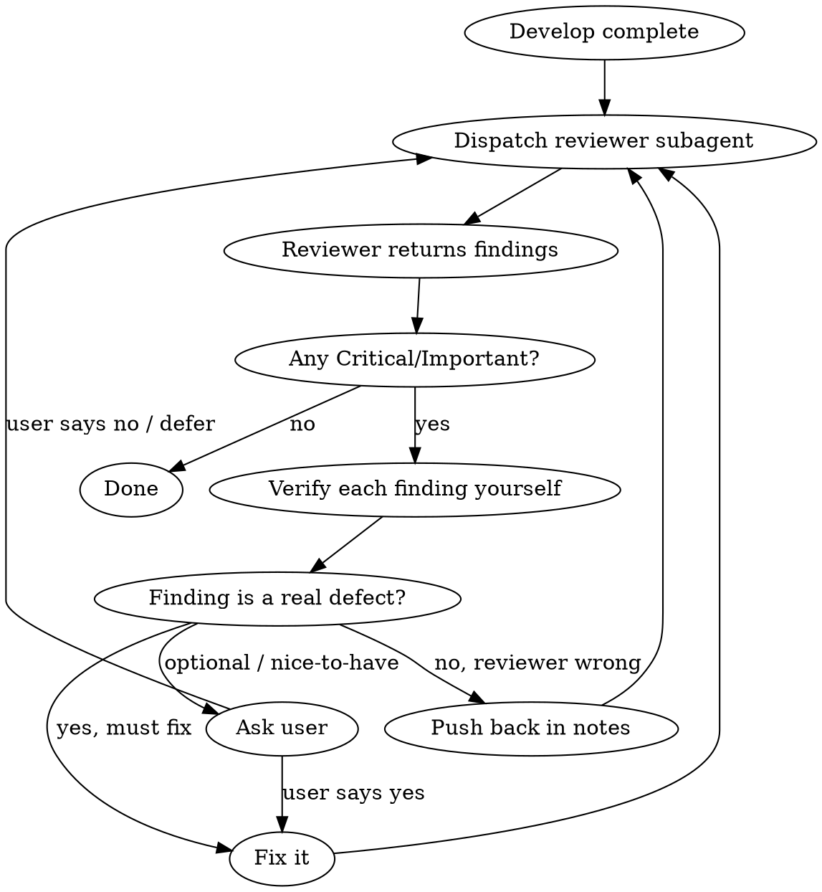

# Review Until Clean

## Overview

A tight loop that drives a codebase to zero review findings by combining **independent review** with **firsthand verification**.

```
Develop → Dispatch reviewer → Verify each finding yourself → Fix real issues → Re-review → repeat until clean
```

**Two pillars that make this work:**

1. **You verify every reported issue yourself.** The reviewer is a hypothesis generator, not an oracle. You open the file, read the code at the cited line, and confirm the bug actually exists before touching anything. Reviewers hallucinate, misread scope, and flag style as Critical. Blindly applying their list creates churn and new bugs.

2. **You only fix what must be fixed.** Critical/Important issues with a real defect get fixed. Optional improvements (Minor, style, "nice to have") get surfaced to the user — they don't enter the fix loop, or they'll burn the loop on polish forever.

**REQUIRED SUB-SKILL:** Use `superpowers:requesting-code-review` for the dispatch mechanics (getting SHAs, filling the reviewer template).

## When to Use

**Manual-only.** This skill runs ONLY when the user explicitly invokes it (e.g. `/review-until-clean`). Do not load it yourself based on "the code is done", "ready to merge", or any other inference — even if the situation looks like a perfect fit. If you think it applies, suggest it to the user instead of auto-loading.

Typical contexts where the user invokes it:
- A feature or codebase is functionally complete
- Before merge to main / release
- The user wants a clean reviewer sign-off, not just "I glanced at it"

**Do NOT use for:** reviewing a single trivial change (just review it yourself), or mid-task checkpoints inside subagent-driven development (use requesting-code-review directly per task).

## The Loop



### Step 1 — Dispatch the reviewer

Use `superpowers:requesting-code-review`. Get `BASE_SHA` and `HEAD_SHA`, dispatch a `general-purpose` subagent with the code-reviewer template.

Each review pass should be against a **fresh base→head range** that covers everything since the original baseline, so the reviewer sees the accumulated state — not just the last delta. Keep `BASE_SHA` fixed at the original starting commit; advance `HEAD_SHA` as you fix.

### Step 2 — Verify EVERY finding yourself

This is the discipline. For each issue the reviewer reports:

1. Open the exact `file:line` they cited.
2. Read the surrounding code with your own eyes.
3. Decide one of three verdicts:

| Verdict | Meaning | Action |
|---------|---------|--------|
| **Real defect, must fix** | Bug, broken behavior, security hole, data-loss risk, missing required feature | Fix it now |
| **Reviewer wrong** | They misread the code, the "bug" is correct, or it's out of scope | Do not change code. Note the pushback with your technical reasoning |
| **Optional / nice-to-have** | Style, minor optimization, polish — code works correctly without it | Ask the user whether to fix; do NOT silently fix or silently drop |

**You do the verification, not another subagent.** The whole point of this skill is that the main session takes responsibility for distinguishing real from hallucinated. Do not delegate this judgment.

### Step 3 — Fix the real, must-fix issues

- Fix only what you personally confirmed.
- Run the test suite after fixing (if the project has one).
- Stage and commit the fixes so the next review sees clean history.
- Update `HEAD_SHA`.

### Step 4 — Re-dispatch and repeat

Send the reviewer again with the same `BASE_SHA` and the new `HEAD_SHA`. Loop until the reviewer returns **no Critical and no Important issues** — i.e. a clean assessment.

A pass that returns only Minor/optional items counts as "clean for the loop" — surface those to the user, don't fix-and-reloop on them.

## When to Stop

**Stop (clean) when:** the reviewer's report contains zero Critical and zero Important issues.

**Stop (blocked) and ask the user when:**
- Two consecutive passes disagree about whether something is a bug → you're guessing. Ask.
- You've hit 4+ review rounds without converging → likely a design disagreement, not a bug-hunt. Escalate to the user.
- A finding is genuinely optional → ask before spending a fix round on it.

**Never stop because:** "the reviewer seemed satisfied," "good enough," or "I'm tired of the loop." Either the report is clean (stated explicitly) or it isn't.

## Fix Triage — the only three buckets

When you verify a finding, it lands in exactly one bucket. There is no fourth "I'll fix it anyway because it's easy" bucket.

- **Must fix** → Critical/Important defects you confirmed are real. Fix immediately.
- **Push back** → Reviewer is wrong. Leave the code alone, record why.
- **Ask user** → Anything optional, ambiguous, or scope-expanding. This is where "可修可不修" lives.

The trap this prevents: turning a bug-fix loop into a refactor/polish loop that never converges. Optional improvements are not bugs. They don't belong in the convergence loop.

## Common Rationalizations to Reject

| Excuse | Reality |
|--------|---------|
| "The reviewer found it, so it must be real" | Reviewers hallucinate. Verify with your own eyes. |
| "I'll just fix everything they listed" | That includes wrong findings and optional polish → churn, new bugs, no convergence. |
| "It's Minor, I'll fix it quickly" | Optional fixes have no place in the must-fix loop. Ask the user or defer. |
| "I'll trust the reviewer on this one, I didn't read it" | No. Verification is non-delegable. Open the file. |
| "Reviewer returned empty, we're done" | Confirm the report actually says zero Critical/Important. "No major issues" sometimes hides a buried Important item. |
| "We've reviewed 5 times, let's call it" | If the report still has Critical/Important, you're not done. Escalate to user if you can't converge. |
| "The reviewer is being picky, I'll ignore it" | Only after you've verified and confirmed it's wrong or optional. Then it's judgment, not avoidance. |

## Checklist (per round)

- [ ] Reviewer dispatched against correct BASE→HEAD range
- [ ] Every Critical/Important finding: opened file:line, read code, assigned a verdict
- [ ] Must-fix items: fixed, tests run, committed
- [ ] Wrong findings: pushback recorded with reasoning
- [ ] Optional items: surfaced to user (not silently fixed)
- [ ] If Critical/Important remain → next round. Else → done.
